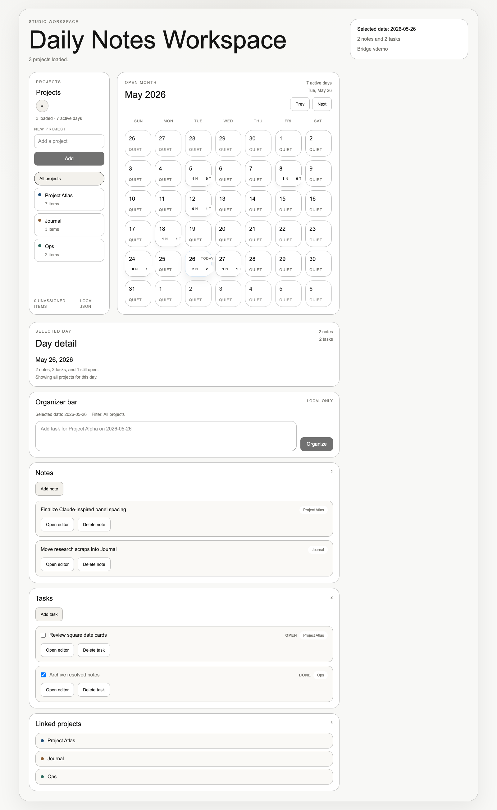
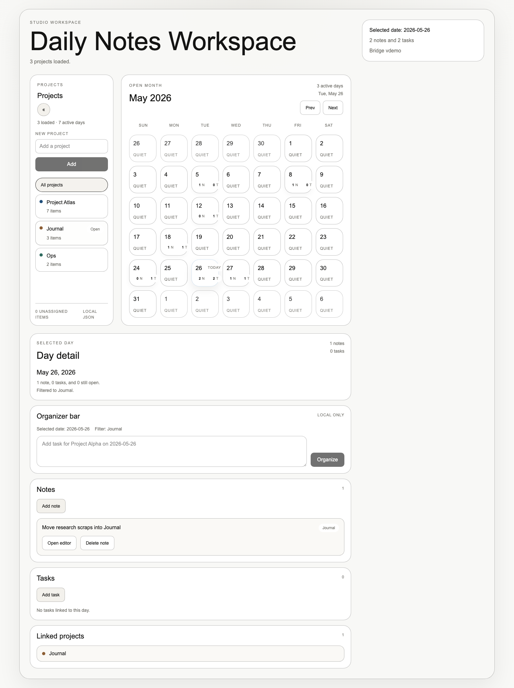
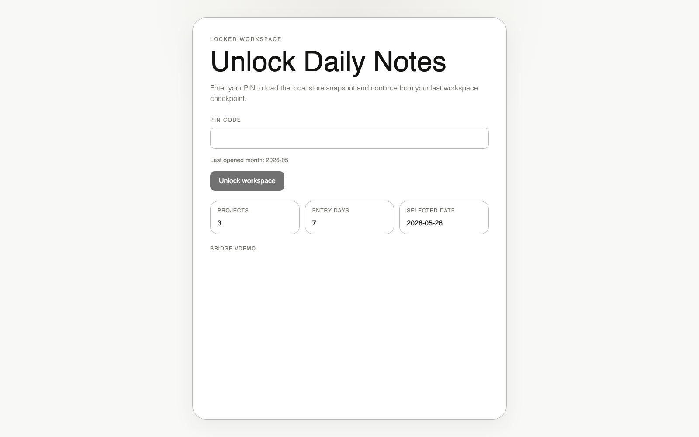

<p align="center">
  
</p>

<h1 align="center">Solstice</h1>

<p align="center">
  <strong>A calm, local-first daily planner for people who think in days.</strong>
  <br />
  <em>Your work happens in days. Solstice keeps it that way.</em>
</p>

<p align="center">
  <a href="#features">Features</a> &bull;
  <a href="#install">Install</a> &bull;
  <a href="#development">Development</a> &bull;
  <a href="#architecture">Architecture</a> &bull;
  <a href="#contributing">Contributing</a> &bull;
  <a href="#license">License</a>
</p>

<p align="center">
  
  
  
  
  
</p>

---

Not another generic note-taking app. **Solstice** is built around one idea: your work happens in days. Each day gets its own space for quick notes and checkbox tasks. No folders, no infinite nesting, no complexity creep.

Everything stays on your machine. No accounts, no cloud sync, no telemetry. Just a lightweight Electron app with local JSON storage that opens instantly and gets out of your way.

## Features

### Calendar-First Navigation

Navigate your work through a clean month grid. Each day card shows activity at a glance with dot indicators and task completion counts. Click any day to see its notes and tasks.

<p align="center">
  
</p>

### Quick Tasks with Context

Add tasks with checkbox completion, descriptions, URLs, and priority levels. Tasks are meant to be daily-scoped - things you'll get done today, not a backlog that grows forever.

### Notes That Stay Brief

Capture thoughts, meeting notes, and observations tied to the day they happened. No formatting toolbar, no templates - just text that belongs to a specific day.

### Knowledge Graph

See connections between your days, projects, and tags as a force-directed graph. Days with more activity appear larger. Click any node to navigate.

### Activity Heatmap

A GitHub-style contribution grid showing your activity patterns over the past year. See streaks, active days, and how your work distributes across the calendar.

### Instant Search

Press `Cmd+K` to search across all your notes and tasks. Results are grouped by date with keyboard navigation.

### Project Organization

Group notes and tasks by project. Filter the entire workspace to focus on one project at a time. The projects sidebar is collapsible so it's there when you need it.

<p align="center">
  
</p>

### Local PIN Lock

A simple PIN screen keeps your workspace private on shared machines. Not enterprise security - just a quick lock for personal use.

<p align="center">
  
</p>

### Keyboard-Driven

| Shortcut | Action |
|----------|--------|
| `Cmd+K` | Open search |
| `T` | Jump to today |
| `1` `2` `3` | Switch views (Calendar, Graph, Activity) |
| `Cmd+Left` | Previous month |
| `Cmd+Right` | Next month |

## Install

### Download

Packaged releases for macOS, Windows, and Linux are coming soon. For now, build from source:

```bash
git clone https://github.com/amit-biswas-1992/solstice.git
cd solstice
npm install
npm run package
```

The built app appears in `dist/`.

### From Source

```bash
npm install
npm run dev:electron
```

The default PIN for a fresh workspace is `1234`.

## Development

### Prerequisites

- Node.js 20+
- npm 10+

### Scripts

```bash
npm run dev:electron    # Start the full Electron app
npm run dev             # Start only the Vite renderer
npm test                # Run unit tests
npm run test:watch      # Tests in watch mode
npm run smoke           # Playwright end-to-end tests
npm run build           # Production build
npm run package         # Package desktop app
```

### Project Structure

```
solstice/
  electron/              # Main process
    main.ts              # Window setup and lifecycle
    preload.ts           # Sandboxed IPC bridge
    ipc/                 # Channel handlers
    storage/             # JSON persistence layer
  src/                   # Renderer (React)
    components/
      calendar/          # MonthGrid, DayCard
      day/               # DayDetailPanel, TasksSection, NotesSection
      graph/             # Force-directed knowledge graph
      heatmap/           # Activity contribution grid
      search/            # Cmd+K search overlay
      projects/          # Project sidebar
      auth/              # PIN lock screen
      layout/            # WorkspaceShell
    lib/                 # Date utils, command parser
    types/               # TypeScript types, Zod schemas
    styles/              # Tailwind theme
```

## Architecture

### Local-First by Design

All data lives as JSON files in the OS app data directory. No database, no cloud service, no network requests. The app works completely offline and starts instantly.

```
~/Library/Application Support/daily-notes-desktop/
  store/
    current.json         # Points to active snapshot
    snapshots/
      <snapshot-id>/
        settings.json    # PIN, last opened state
        entries.json     # Notes and tasks by date
        projects.json    # Project definitions
```

### Process Isolation

The renderer process has zero access to the filesystem. All data flows through a typed IPC bridge with Zod validation on every payload:

```
Renderer  -->  Preload Bridge  -->  IPC Handler  -->  File Storage
(React)        (contextBridge)      (ipcMain)         (JSON files)
```

### Tech Stack

| Layer | Technology |
|-------|-----------|
| Desktop shell | Electron 35 |
| Renderer | React 19 + TypeScript |
| Styling | Tailwind CSS v4 |
| Build | Vite 6 |
| Validation | Zod |
| Testing | Vitest + Playwright |
| Packaging | electron-builder |

## Roadmap

- [ ] Markdown support in notes
- [ ] Drag and drop tasks between days
- [ ] Recurring tasks
- [ ] Daily templates
- [ ] Data export (JSON, Markdown)
- [ ] Auto-update with electron-updater
- [ ] Encrypted storage option
- [ ] Custom themes
- [ ] Plugin system for extensions

## Contributing

Contributions are welcome! See [CONTRIBUTING.md](CONTRIBUTING.md) for guidelines.

Whether it's a bug report, feature idea, or code contribution - we'd love your help making daily planning better.

## License

[MIT](LICENSE) - use it however you want.
